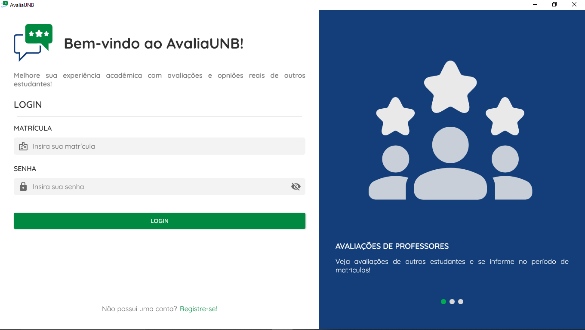
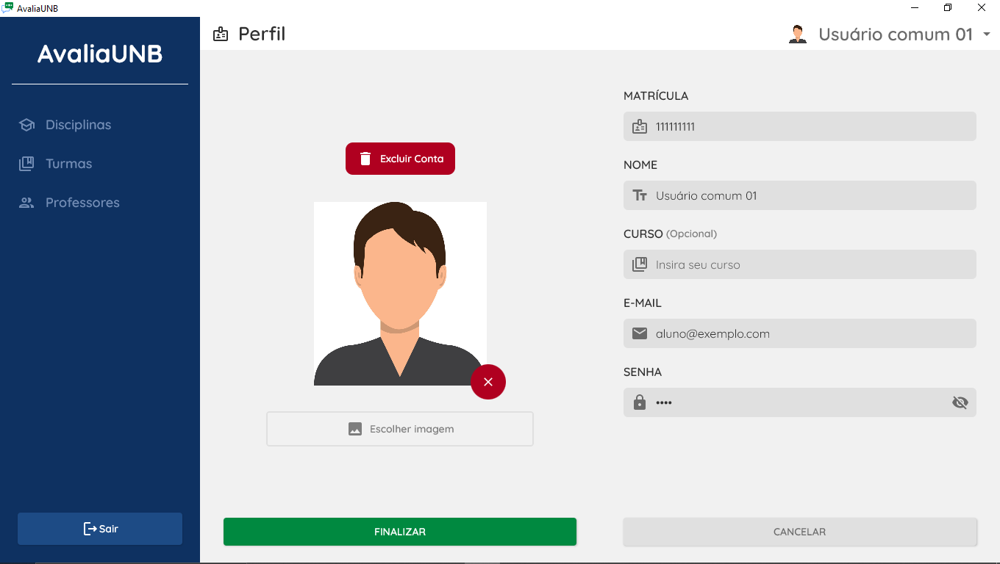
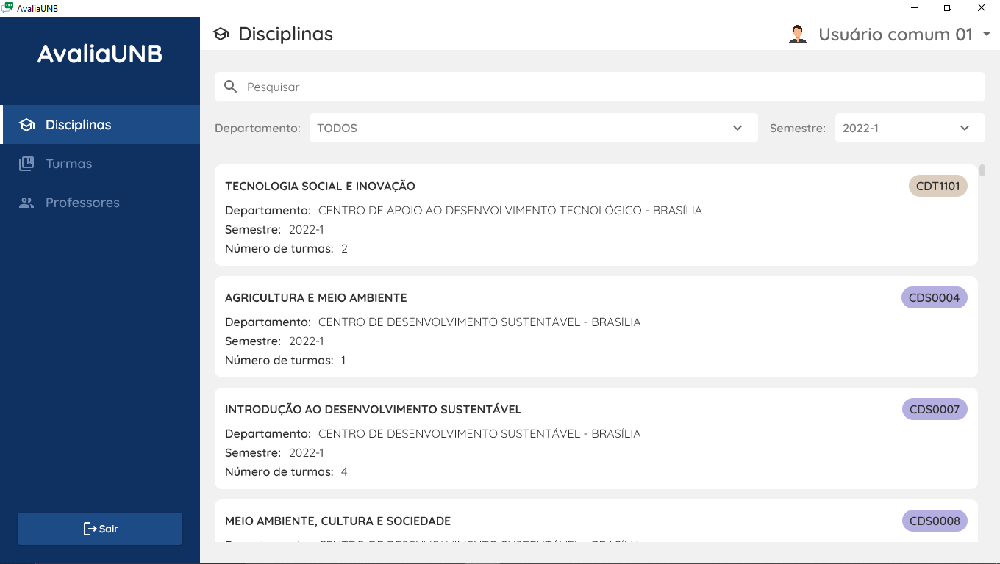
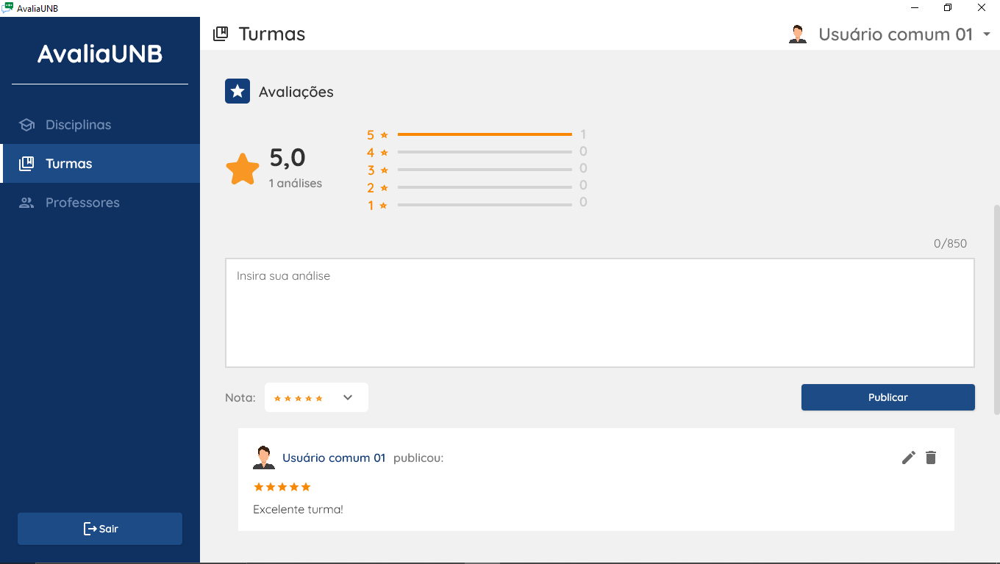

# (BD - 2023-1): AvaliaUNB

<h1 align="center">
    
</h1>
<p align="center">Sistema de avaliação de disciplinas e professores da UnB</p>

* [Sobre o Projeto](#sobre-o-projeto)
* [Execução](#execução)
    * [Requisitos](#requisitos)
    * [Como executar](#como-executar)
* [Configurações adicionais (Opcional)](#configurações-adicionais-opcional)
* [Dados de Teste](#dados-de-teste)
* [Funcionalidades](#funcionalidades)
* [Tecnologias Utilizadas](#tecnologias-utilizadas)
* [Showcase](#showcase)

---

## Sobre o projeto

O AvaliaUNB se trata de um aplicativo que permite aos estudantes avaliarem professores e turmas de diferentes disciplinas e semestres.  

O aplicativo foi desenvolvido como projeto final da discplina de Bancos de Dados (BD) ofertada pela [Universidade de Brasília](https://www.unb.br/) durante o semestre 2023/1. 

<h1 align="center">
    
</h1>

---

## Execução

Primeiramente faça o clone deste repositório para o seu ambiente local ou então baixe o ZIP com todos os arquivos.

```
git clone https://github.com/enzzoMs/BD_AvaliaUNB.git
```

### Requisitos

Para a exucação do projeto basta ter o Java JDK 11 ou superior instalado no seu sistema.

### Como executar

Abra o terminal ou prompt de comando e navegue até o diretório raiz do projeto:

```
cd BD_AvaliaUNB/AvaliaUNB
```

Utilize o seguinte comando:

```
gradlew run
```

Esse comando vai checar e baixar as dependências, compilar e executar o projeto. Depois disso o AvaliaUnB deve ser iniciado, mostrando a interface gráfica para interação.

Certifique-se de que todas as dependências são baixadas corretamente e não há erros relatados durante o processo de compilação. Caso ocorra algum erro, verifique se você possui as versões corretas do Java JDK instaladas e se todos os arquivos do projeto foram clonados corretamente.

---

## Configurações adicionais (Opcional)

O AvaliaUNB utiliza SQLite, portanto o banco de dados já vem embutido no próprio projeto e não necessita de configuração separada. Porém, no caso deste aplicativo é possível ainda especificar alguns parâmetros para a inicialização dos dados.

Essas configurações podem ser encontradas no arquivo
`database_config.properties` localizado em:

```
AvaliaUNB/src/jvmMain/resouces/database/database_config.properties
```
 
As configurações disponíveis são:

```
incluir_dados_2022_1=true
incluir_dados_2022_2=true
incluir_dados_2023_1=false
reiniciar_banco_de_dados=true 
```

As três primeiras configurações permitem personalizar quais dados serão incluídos no aplicativo quando o banco de dados for reiniciado. Esses dados fazem parte de arquivos `.CSV` disponíveis em `resouces/database/data`. 

A última configuração indica se o banco de dados deve ser reiniciado. Caso o campo tenha valor `true` da próxima vez que o aplicativo for inicializado todos os dados atuais do banco serão excluídos e os dados dos `.CSV` (se indicados) serão inseridos. 

---

## Dados de Teste

Independende da configuração ao ser inicializado o banco de dados já vai conter alguns registros de teste populados com o arquivo `resouces/database/data/avalia_unb_default_data.sql`

Isso inclui alguns usuários e administradores:

```
Usuário Comum 01:
Matrícula: 111111111
Senha: 1234
```

```
Administrador 01:
Matrícula: 333333333
Senha: 1234
```

---

## Funcionalidades 

* Cadastro de estudantes: Cadastro de usuários e validação de login (apenas consulta no banco de dados).

* Avaliações: Os estudantes podem postar avaliações de professores e turmas de diferentes semestres, eles podem editar e excluir seus próprios comentários.

* Pontuação: Cada professor e turma tem uma pontuação baseada nas valiações feitas.

* Denúncia de comentários ofensivos: Os usuários têm a opção de denunciar comentários ofensivos. Essas denúncias são avaliadas por administradores.

* Avaliação de denúncias: Os administradores podem ignorar a denúncia, aceitá-la e remover o comentário ofensivo, ou até mesmo excluir a conta do estudante responsável pelo comentário.


---

## Tecnologias utilizadas

Linguagem: [Kotlin](https://kotlinlang.org/)

Interface gráfica: [Compose Multiplatform](https://www.jetbrains.com/lp/compose-multiplatform/) - [Desktop](https://github.com/JetBrains/compose-multiplatform-desktop-template/#readme)

Banco de Dados: [JDBC](https://docs.oracle.com/javase/8/docs/technotes/guides/jdbc/) + [SQLite](https://www.sqlite.org/index.html)

Injeção de dependência: [Dagger2](https://dagger.dev/)

Arquitetura: [MVVM (Model–View–ViewModel)](https://en.wikipedia.org/wiki/Model%E2%80%93view%E2%80%93viewmodel)

---

## Showcase


<h1 align="center">
    
</h1>

<h1 align="center">
    
</h1>

<h1 align="center">
    
</h1>

<h1 align="center">
    
</h1>
